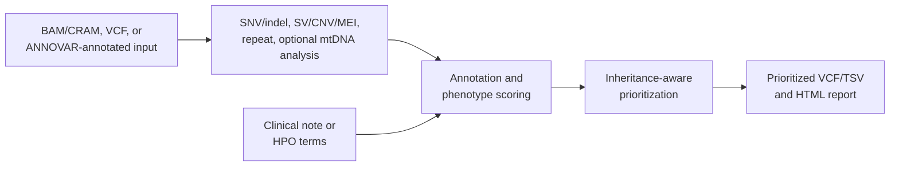

# PipeVar

PipeVar is a Nextflow DSL2 workflow for phenotype-guided rare-disease variant
prioritization from short-read and long-read data. It supports nuclear
SNV/indel, structural-variant, copy-number, mobile-element, repeat-expansion,
and optional mitochondrial analysis through single-sample and batch execution.

This README is the operator-facing contract for PipeVar 0.5.0. PipeVar is under
active development; use the supported combinations documented here and review
prioritized results before downstream interpretation.

## Table of contents

- [Overview](#overview)
- [Quick start](#quick-start)
- [Supported workflows](#supported-workflows)
- [Input requirements](#input-requirements)
- [CSV manifests](#csv-manifests)
- [Installation and runtime](#installation-and-runtime)
- [Workflow stages](#workflow-stages)
- [Feature behavior](#feature-behavior)
- [Parameter reference](#parameter-reference)
- [Examples](#examples)
- [Outputs](#outputs)
- [Troubleshooting](#troubleshooting)
- [Reproducibility](#reproducibility)
- [Documentation and software](#documentation-and-software)
- [Support](#support)

## Overview

PipeVar combines genotype, population-frequency, clinical, phenotype, and
inheritance evidence to produce prioritized candidate variants and genes.



Major capabilities are:

- short-read and long-read SNV/indel calling;
- short-read and long-read structural-variant analysis;
- short-read CNV and optional mobile-element analysis;
- short-read and long-read repeat-expansion analysis;
- phenotype extraction from clinical notes or direct HPO input;
- phenotype-guided annotation and candidate ranking;
- inheritance-aware small-variant and structural-variant filtering;
- optional family-based de novo filtering in batch runs;
- optional short-read or long-read mitochondrial analysis; and
- prioritized VCFs, evidence tables, and combined HTML reports.

For conceptual workflow figures, see
[`docs/WORKFLOW.md`](docs/WORKFLOW.md) and
[`docs/PIPEVAR_NUCLEAR_FIGURES.md`](docs/PIPEVAR_NUCLEAR_FIGURES.md). This
README remains authoritative for supported command-line behavior.

## Quick start

### 1. Install prerequisites

Before running PipeVar, provide:

- Nextflow and a compatible Java runtime;
- Docker or Singularity/Apptainer;
- access to SLURM when using the default `standard` profile;
- a licensed ANNOVAR installation containing `annotate_variation.pl`;
- PhenoSV model resources;
- an hg38 reference FASTA and the companion files required by the selected
  workflow; and
- sufficient local or scheduler resources for the selected callers.

The setup helper also requires common shell utilities including Bash, Perl,
`wget`, `tar`, `unzip`, `sed`, and `awk`, plus outbound network access.

### 2. Clone PipeVar

```bash
git clone https://github.com/WGLab/PipeVar.git PipeVar
cd PipeVar
```

Run `setup.sh` from the repository root. It resolves paths relative to the
current directory and updates `nextflow.config`.

```bash
bash setup.sh --non-interactive \
  --profile=local_docker \
  --annovar-dir=/data/annovar \
  --phenosv-dir=/data/PhenoSV_model \
  --annovar-bind=/data/annovar \
  --phenosv-bind=/data/PhenoSV_model
```

`--profile=local_docker` in this setup command rewrites `profiles.standard` to
use local Docker. It does not rewrite the separately named `local_docker`
profile. See [Setup behavior](#setup-behavior) before rerunning setup.

### 3. Check the command-line interface

```bash
nextflow run main.nf --help
```

PipeVar does not currently ship a supported test-data profile. The commands
below therefore use data placeholders and should be adapted to local inputs.

### 4. Run one sample locally with Docker

```bash
nextflow run main.nf \
  -profile local_docker \
  --bam /data/sample.bam \
  --ref_fa /refs/hg38.fa \
  --hpo /data/sample.hpo.txt \
  --type short \
  --out_prefix sample \
  --output_directory /results/sample
```

### 5. Run a batch on SLURM with Singularity

```bash
nextflow run main.nf \
  -profile slurm_singularity \
  --input_csv /data/samples.csv \
  --bam true \
  --note no \
  --ref_fa /refs/hg38.fa \
  --type ont \
  --output_directory /results/cohort
```

Add `-resume` to reuse successful cached tasks when the pipeline code, inputs,
parameters, containers, and mounted resources are unchanged.

## Supported workflows

### Input and mode matrix

`--mode snp` runs the nuclear SNV/indel branch, `--mode sv` runs the
SV/CNV/MEI and repeat branch, and omitting `--mode` runs the supported combined
branches for alignment input.

| Input route | Supported sequencing type | Supported mode | Main conditions |
| --- | --- | --- | --- |
| Single BAM/CRAM | `short`, `ont`, `pacbio` | `snp`, `sv`, or combined | Requires alignment index, reference, and phenotype |
| Legacy CSV BAM/CRAM | `short`, `ont`, `pacbio` | `snp`, `sv`, or combined | Add `--bam true`; one row per sample |
| Unified CSV `bam_ngs`/`cram_ngs` | `short`, `ont`, `pacbio` | `snp`, `sv`, or combined | Do not add legacy `--bam true`; `--type` selects the route |
| Single VCF | Not applicable | `snp` or `sv` required | Existing calls are re-annotated and prioritized |
| Legacy CSV VCF | Not applicable | `snp` or `sv` required | Add `--vcf true` |
| Unified CSV `vcf_snv`/`vcf_sv` | Not applicable | Inferred from `input_kind` | Omit `--mode`; contradictory overrides are not supported |
| Single pre-annotated SNV | Not applicable | `snp` or omitted | Requires paired ANNOVAR multianno TXT and VCF |
| Unified CSV `annotated_snv` | `short` only when alignment is supplied | SNP-led or supported combined batch route | All rows must use the same alignment/SV-input pattern |

The README does not advertise internally present experimental modules or routes
that are not consistently wired across the current workflow.

### Caller and analysis matrix

| Data | Full SNP caller | Light SNP caller | SV/CNV/MEI | Repeat analysis |
| --- | --- | --- | --- | --- |
| Short-read | DeepVariant | GATK HaplotypeCaller | Manta; CNVnator by default; optional xTEA | ExpansionHunter |
| ONT | Clair3 | NanoCaller | Sniffles | NanoRepeat |
| PacBio | Clair3 | NanoCaller | Sniffles | NanoRepeat |
| Existing VCF | Supplied calls | Not applicable | Supplied calls | Not available without an alignment |

`--light yes` selects HaplotypeCaller for short-read SNPs, NanoCaller for
long-read SNPs, and the light PhenoSV configuration where SV scoring is used.
The supported operator subset documented here uses light mode with
`--mode snp`; use the default full configuration for combined analysis.

### Optional-feature matrix

| Feature | Enable with | Supported input | Supported mode and restrictions |
| --- | --- | --- | --- |
| Mitochondrial analysis | `--mito yes` | BAM/CRAM, including alignment-backed annotated batch input | `snp` or combined; not `sv`; not long-read light |
| xTEA | `--xtea yes` | Short-read BAM/CRAM | `sv` or combined; not `snp` |
| CNVnator | `--cnvnator yes` | Short-read BAM/CRAM full SV/combined routes | Enabled by default |
| Targeted calling | `--target yes` | Supported SNP-calling/re-annotation routes | Uses top Phen2Gene regions; not supported for unified `annotated_snv` input |
| Gene restriction | `--gene <LIST_OR_FILE>` | Final prioritization routes | Comma-separated symbols or one symbol per line |
| De novo filtering | `--denovo_filter yes` | CSV family cohorts | Requires pedigree columns; parents/siblings are controls only |
| PhenoGPT2 | `--phenotype_extractor phenogpt2 --GPU yes` | Clinical-note input | Requires external model mounts; not used for HPO input |

Mitochondrial analysis is opt-in; its default is `--mito no`.

## Input requirements

### Reference genome

Alignment-driven workflows require `--ref_fa`. Any supplied FASTA requires a
samtools index at `<reference>.fai`.

The active ANNOVAR processes use hg38 and expect the database set installed by
`setup.sh`, including refGene, cytoBand, ExAC 0.3, avsnp147, dbNSFP 4.7a,
gnomAD 4.1 exome/genome, ClinVar 2024-09-17, and GTEx v8 eQTL/sQTL resources.
Do not mix input coordinates, alignment references, and annotations from
different genome builds.

Short-read mitochondrial analysis additionally requires files beside the
reference FASTA:

- a sequence dictionary named `<reference-basename>.dict`; and
- BWA sidecars `<reference>.amb`, `.ann`, `.bwt`, `.pac`, and `.sa`.

Long-read mitochondrial analysis requires the FASTA index but not the BWA
sidecars or GATK dictionary.

### Alignment input

- BAM input requires an index named either `<file>.bam.bai` or
  `<file-basename>.bai` where supported by the manifest parser.
- CRAM input requires `<file>.cram.crai` or `<file-basename>.crai`.
- CRAM decoding requires the exact matching reference.
- Short-read mitochondrial preprocessing realigns the mitochondrial reads and
  assumes any DRAGEN CRAM was created against that reference bundle.

### Phenotype input

Every analyzed proband needs one phenotype source:

- `--hpo <FILE>` for an HPO-term file; or
- `--note <FILE>` for a clinical note processed by the configured phenotype
  extractor.

For legacy CSV input, `note_path` is a clinical note by default. Set
`--note no` to interpret every `note_path` as an HPO file. Unified manifests use
the per-row `phenotype_format` field.

Clinical-note extraction defaults to PhenoTagger. PhenoGPT2 requires
`--phenotype_extractor phenogpt2`, `--GPU yes`, and the model configuration in
[PhenoGPT2 and GPU execution](#phenogpt2-and-gpu-execution).

### Single-file input

Single alignment input requires:

```text
--bam <BAM_OR_CRAM> --ref_fa <FASTA> (--note <FILE> | --hpo <FILE>)
```

Single VCF input requires an explicit mode:

```text
--vcf <VCF> --mode <snp|sv> (--note <FILE> | --hpo <FILE>)
```

Supplying `--ref_fa` for VCF input is recommended and is required when targeted
region construction is requested. Unified VCF manifests currently require it.

Single pre-annotated SNV input requires:

```text
--annotated_snv yes \
--annovar_txt <PREFIX.hg38_multianno.txt> \
--vcf <PREFIX.hg38_multianno.vcf> \
(--note <FILE> | --hpo <FILE>)
```

PipeVar validates and passes the original paired TXT/VCF files downstream; it
does not publish full-size validated copies.

## CSV manifests

PipeVar supports a legacy three-column family and a unified typed manifest.
Do not combine unified manifests with legacy `--bam true` or `--vcf true` flags.

### Legacy CSV

The base schema is:

```csv
sample,file_path,note_path
sample1,/data/sample1.bam,/phenotypes/sample1.hpo.txt
```

| Column | Required | Description |
| --- | --- | --- |
| `sample` | Yes | Unique output prefix; use letters, numbers, `.`, `_`, and `-` for de novo cohorts |
| `file_path` | Yes | BAM, CRAM, or VCF selected by the command-line legacy flag |
| `note_path` | Proband; all rows outside de novo mode | Clinical note by default, or HPO file with `--note no` |
| `age_of_onset` | No | Integer or integer plus `d`, `m`, or `y`; bare integers become years |
| `age` | No | Used only when `age_of_onset` is absent |
| `sex` | No | `unknown`, `male`, or `female`; column name can be changed with `--sex_column` |

Invoke a legacy alignment manifest with `--input_csv <FILE> --bam true` and a
legacy VCF manifest with `--input_csv <FILE> --vcf true --mode <snp|sv>`.

### Unified CSV

Required headers are `sample`, `input_kind`, `phenotype_path`, and
`phenotype_format`. The helper emits a wider schema so one layout can represent
all supported row types:

```csv
sample,input_kind,phenotype_path,phenotype_format,age_of_onset,sex,snv_txt_path,snv_vcf_path,sv_vcf_path,vcf_path,alignment_path,alignment_index_path
sample1,bam_ngs,/phenotypes/sample1.hpo.txt,hpo,,female,,,,,/data/sample1.bam,/data/sample1.bam.bai
```

| Column | Used by | Description |
| --- | --- | --- |
| `sample` | All rows | Unique join key and output prefix |
| `input_kind` | All rows | `annotated_snv`, `vcf_snv`, `vcf_sv`, `bam_ngs`, or `cram_ngs` |
| `phenotype_path` | All proband rows | Clinical note or HPO file |
| `phenotype_format` | All analyzed rows | Exactly `clinical_note` or `hpo` |
| `age_of_onset` | All rows | Optional normalized age |
| `sex` | All rows | Optional `unknown`, `male`, or `female` |
| `snv_txt_path` | `annotated_snv` | ANNOVAR multianno TXT |
| `snv_vcf_path` | `annotated_snv` | Matching ANNOVAR multianno VCF |
| `sv_vcf_path` | Annotated combined batch routes | Optional pre-annotated SV VCF |
| `vcf_path` | `vcf_snv`, `vcf_sv` | Existing VCF |
| `alignment_path` | `bam_ngs`, `cram_ngs`, annotated hybrid routes | BAM or CRAM |
| `alignment_index_path` | Alignment-backed routes | Explicit BAM/CRAM index; the helper may discover it |

Unified-manifest constraints are:

- sample identifiers must be unique;
- rows must form a supported homogeneous group, except that `bam_ngs` and
  `cram_ngs` may be mixed;
- all `annotated_snv` rows must consistently provide or omit
  `alignment_path`;
- all `annotated_snv` rows must consistently provide or omit `sv_vcf_path`;
- non-annotated manifests cannot mix phenotype formats; and
- annotated alignment-backed input currently supports short reads only.

The four supported annotated batch layouts are SNV only, annotated SNV plus
annotated SV without alignment, annotated SNV plus alignment with SV calling,
and annotated SNV plus annotated SV plus alignment. Routes without an alignment
cannot run repeat or mitochondrial analysis.

### Family metadata and de novo filtering

With `--denovo_filter yes`, add the configured family columns to the CSV:

```csv
sample,file_path,note_path,family_id,role,vcf_sample,sex
child,child.bam,child.hpo.txt,F1,proband,CHILD,male
mother,mother.bam,,F1,mother,MOTHER,female
father,father.bam,,F1,father,FATHER,male
```

Each family requires exactly one proband and at least one parent. Supported
roles are `proband`, `father`, `mother`, and `sibling`. Sample identifiers must
be globally unique. Parents and siblings act as variant controls; only probands
continue through phenotype extraction, sample prioritization, optional repeat
or mitochondrial analysis, and final reporting.

The relevant column names can be changed with `--denovo_role_column`,
`--denovo_family_column`, and `--denovo_vcf_sample_column`.

### CSV generator

Run the interactive helper from the repository:

```bash
./scripts/generate_input_csv.sh
```

It can create legacy or unified manifests and add `sv_vcf_path` to an existing
unified annotated-SNV manifest. Important limits are:

- it has no non-interactive command-line mode;
- it scans only the selected directory's top level;
- file pairing uses exact, normalized, containment, and first-token matching;
- ambiguous or incomplete pairs can be skipped;
- missing indexes can result in a blank index field;
- it rejects commas and does not implement quoted RFC-style CSV fields;
- duplicate inferred sample prefixes keep the first match with a warning; and
- it is a manifest generator, not a replacement for PipeVar input validation.

Use a different output path for the update action; the helper does not overwrite
the source CSV in place.

## Installation and runtime

### Execution profiles

| Profile | Executor | Container backend | Intended environment |
| --- | --- | --- | --- |
| `standard` | SLURM by default | Singularity | Default installation; may be rewritten by `setup.sh` |
| `slurm_singularity` | SLURM | Singularity | Explicit cluster profile |
| `local_singularity` | Local | Singularity | Workstation or single server |
| `local_docker` | Local | Docker | Docker-capable workstation or server |

Container profiles bind:

| Host parameter | Container path | Purpose |
| --- | --- | --- |
| `--annovar_host_path` | `/annovar` | Licensed ANNOVAR installation and databases |
| `--phenosv_host_path` | `/PhenoSV/train_data` | PhenoSV model resources |

The mitochondrial annotation databases are built into its image except for the
optional `--hmtvar_data` input. PhenoGPT2 models are always supplied externally.

### Setup behavior

ANNOVAR must first be obtained through its
[registration and download process](https://www.openbioinformatics.org/annovar/annovar_download_form.php).
The directory passed to setup must contain `annotate_variation.pl`.

```bash
# Full PhenoSV resources
bash setup.sh

# Light PhenoSV resources; "light" is a positional token
bash setup.sh light
```

Supported setup options are:

```text
--non-interactive
--profile=standard|slurm_singularity|local_singularity|local_docker
--annovar-dir=<DIR>
--phenosv-dir=<DIR>
--annovar-bind=<DIR>
--phenosv-bind=<DIR>
```

Setup downloads the configured hg38 ANNOVAR databases, PhenoSV resources, and
Phen2Gene knowledge-base assets. It also rewrites ANNOVAR/PhenoSV paths and
replaces the `profiles.standard` block in `nextflow.config` with the selected
backend. Repeated runs redownload several assets and should not be treated as a
no-op or strictly idempotent operation.

Setup does not install the reference FASTA/indexes, custom ExpansionHunter
catalog, optional HmtVar data, or PhenoGPT2 models and caches.

### Resource model

All processes use `errorStrategy = 'retry'` with up to three retries. Many CPU
and memory requests scale with `task.attempt`, while wall-time requests remain
fixed. Ensure the executor can satisfy the larger retry requests.

Representative first-attempt allocations are:

| Workload | CPU | Memory | Time |
| --- | ---: | ---: | ---: |
| DeepVariant | 16 | 64 GB | 72 h |
| PhenoGPT2 | 16 by default | 64 GB | 12 h |
| Clair3 | 8 | 32 GB | 72 h |
| NanoCaller | 8 | 32 GB | 48 h |
| Manta | 4 | 32 GB | 48 h |
| CNVnator or xTEA | 2 or 8 | 32 GB | 72 h |
| LongPhase | 4 | 32 GB | 24 h |
| ANNOVAR or repeat callers | 1-2 | 16 GB | 12-72 h |
| Mitochondrial processes | 1-4 | 4-8 GB | 2-8 h |
| Final filters and reports | 1 | 4-8 GB | 1-8 h |

Local profiles do not reduce these configured requests. Review
`nextflow.config` before using a workstation with less memory or CPU capacity.

### PhenoGPT2 and GPU execution

PhenoGPT2 is used only for clinical notes and requires:

```text
--phenotype_extractor phenogpt2
--GPU yes
--phenogpt2_model_host_path /absolute/versioned/new_model
```

With `--phenogpt2_negation yes`, also provide:

```text
--phenogpt2_negation_model_host_path /absolute/versioned/negation-model
--phenogpt2_embedding_model_host_path /absolute/versioned/embedding-model
```

An optional pre-created writable cache can be mounted with
`--phenogpt2_cache_host_path`. Model mounts are read-only; the cache mount is
read-write. Paths must be absolute and available at the same location on the
submit and compute nodes.

The supported PhenoGPT2 execution contract keeps batch size, chunk batch size,
and maximum forks at `1`, with word-count chunking disabled (`0`). The configured
GPU backend adds `--nv` for Singularity or `--gpus 1` for Docker and applies
`--gpu_cluster_options` to GPU-backed DeepVariant and PhenoGPT2 tasks.

## Workflow stages

### 1. Phenotype processing

Clinical notes are converted to HPO terms by PhenoTagger or GPU-backed
PhenoGPT2. Direct HPO input bypasses note extraction. Phen2Gene produces a
phenotype-ranked gene list and, with `--target yes`, a restricted interval set.

### 2. Nuclear SNV/indel analysis

Short-read alignments use DeepVariant by default or HaplotypeCaller in supported
light paths. Long-read alignments use Clair3 by default or NanoCaller in light
paths. Supplied VCFs bypass calling. ANNOVAR annotates hg38 variants before
RankVar, RankScore, ClinVar evidence handling, and final SNP prioritization.

### 3. Structural variants, CNVs, and mobile elements

Short-read full paths use Manta, CNVnator by default, and optional xTEA, followed
by Truvari-based merging. Long-read paths use Sniffles. After ANNOVAR SV
annotation, optional common-SV filtering, SURVIVOR conversion, and PhenoSV
scoring, the SV evidence enters SV-only or combined prioritization.

### 4. Repeat expansions

Short-read alignment routes use ExpansionHunter and emit a filtered repeat TSV.
Long-read alignment routes use NanoRepeat and emit
`*_nanorepeat_result.tsv`. VCF-only and annotation-only routes cannot perform
read-backed repeat analysis.

### 5. Mitochondrial analysis

With `--mito yes`, short-read data use a mitochondrial preparation path followed
by Mutect2 mitochondrial calling. Long-read data use a mitochondrial Clair3 call
and VCF postprocessing. Both routes normalize and index the VCF, annotate it,
and produce a prioritized mitochondrial TSV. The mitochondrial branch remains
separate from nuclear `.prio.vcf` files and contributes rows to a combined HTML
report when that report route is available.

### 6. Evidence integration and reporting

SNP-only and SV-only workflows produce branch-specific prioritization. Combined
short-read analysis uses the NGS prioritization path; combined long-read analysis
uses LongPhase with the complete Sniffles VCF for phasing context. Final outputs
include prioritized variant VCFs, gene-focused VCFs, frequency audits, repeat or
mitochondrial evidence when enabled, and an HTML report for combined routes.

## Feature behavior

### Population-frequency and ClinVar handling

Small-variant filtering uses separate effective ceilings:

- `--gnomad_af_ad 0.001` for AD, XLD, and de novo hypotheses; and
- `--gnomad_af_ar 0.01` for AR/XLR hypotheses and upstream retention.

The AD ceiling must not exceed the AR ceiling. Exact threshold values pass.
Missing gnomAD values retain the pipeline's historical zero-frequency behavior;
malformed non-missing values fail validation.

ClinVar P/LP candidates remain available for auditable scenario assignment, but
do not automatically rescue a frequency-incompatible primary scenario.
`--include_clinvar_report` controls ClinVar-exclusive report entries and does not
change classification.

### Common-SV filtering

Common-SV filtering is enabled by default. Effective thresholds are `0.005` for
AD/XLD/de novo/unknown-MOI scenarios and `0.01` for AR/XLR scenarios and
upstream retention. `--common_sv_af` is deprecated; if supplied alone, it maps
the same value to both thresholds and cannot be combined with the split options.

Matching can be tuned with reciprocal-overlap, breakpoint-distance, insertion
distance, and insertion-identity parameters. Mitochondrial events are exempt;
BND/TRA events remain unevaluated by the common-SV matcher.

### Compound-heterozygous phasing

Matching valid phase-set values and opposite phased orientations support a
confirmed trans assignment. Same-phase-set, same-orientation pairs are rejected
as cis. Missing or malformed phase-set values fall back to pipe-phased genotype
orientation. Different valid phase sets, slash-unphased genotypes, and mixed
phased/unphased pairs require `--allow_unphased_comphet yes`.

GT orientation without a shared phase block is heuristic and must not be read as
equivalent to confirmed shared-phase-set evidence.

### Mitochondrial thresholds

Mitochondrial prioritization uses separate call/evidence floors and final-report
thresholds. Defaults are:

- minimum VAF `0.01`, depth `50`, and alternate reads `5`; and
- final-report AF `0.5`, APOGEE2 `0.5`, and MitoTip `12.66`.

The annotation image supplies MITOMAP, MitoTip, t-APOGEE, and MitImpact
resources. HmtVar is optional and reported according to the configured data
state.

## Parameter reference

Defaults are the effective values from `main.nf` and `nextflow.config`.

### Inputs, outputs, and workflow selection

| Parameter | Default | Description |
| --- | --- | --- |
| `--bam` | `null` | Single BAM/CRAM input; legacy CSV selector when set to `true` |
| `--vcf` | `null` | Single VCF input; legacy CSV selector when set to `true` |
| `--input_csv` | `null` | Legacy or unified manifest |
| `--annotated_snv` | `no` | Enable pre-annotated ANNOVAR SNV input |
| `--annovar_txt` | `null` | ANNOVAR hg38 multianno TXT paired with `--vcf` |
| `--ref_fa` | `null` | Reference FASTA |
| `--out_prefix` | `PipeVar` | Single-sample output prefix |
| `--output_directory` | Launch directory | Published-output root |
| `--type` | `ont` | `short`, `ont`, or `pacbio` for alignment input |
| `--mode` | `null` | `snp`, `sv`, or omitted for supported combined alignment routes |
| `--light` | `no` effectively | Use documented light workflow when set to `yes` |
| `--help` | `false` | Print compact command-line help and exit |

### Phenotype and prioritization

| Parameter | Default | Description |
| --- | --- | --- |
| `--note` | `null` | Clinical note path; `no` means legacy CSV `note_path` contains HPO terms |
| `--hpo` | `null` | Direct HPO-term file |
| `--sex_column` | `sex` | CSV sex-metadata column |
| `--inheritance_mode` | `ml` | `ml`, `omim`, or `gnomad`/LOEUF fallback behavior |
| `--gnomad_af_ad` | `0.001` | AD/XLD/de novo small-variant AF ceiling |
| `--gnomad_af_ar` | `0.01` | AR/XLR and upstream small-variant AF ceiling |
| `--include_clinvar_report` | `yes` | Include ClinVar-exclusive report candidates |
| `--allow_unphased_comphet` | `no` | Allow unresolved compound-heterozygous pairs |
| `--prioritize_sv_only` | `no` | Limit combined final prioritization to SV evidence |
| `--rankscore` | `0.50` | Minimum RankScore value |
| `--rankscore_softwares` | All built-ins | Comma-separated RankScore software subset |
| `--rankvar` | `0.05` | Minimum RankVar score |
| `--phenosv_score` | `0.50` | Minimum PhenoSV score |
| `--gq` | `20` | Minimum genotype quality |
| `--ad` | `15` | Minimum allele depth |
| `--nanocaller_dp` | `20` | NanoCaller depth fallback when GQ is absent |
| `--phen2gene_filter` | `500` | Top Phen2Gene genes used for targeted regions |
| `--target` | `no` effectively | Enable phenotype-derived targeted analysis with `yes` |
| `--gene` | `null` | Comma-separated genes or one-gene-per-line file |

### Optional callers and repeats

| Parameter | Default | Description |
| --- | --- | --- |
| `--cnvnator` | `yes` | Add CNVnator in supported short-read full SV/combined routes |
| `--cnvnator_bin_size` | `100` | CNVnator read-depth bin size |
| `--xtea` | `no` | Add xTEA in supported short-read SV/combined routes |
| `--genome` | `hg38` | Select bundled ExpansionHunter catalog naming (`hg38`/`grch38`) |
| `--expansionhunter_variant_catalog` | `null` | Override the bundled ExpansionHunter catalog |
| `--truvari_shortread_refdist` | `1000` | Short-read SV merge reference distance |
| `--truvari_shortread_pctseq` | `0` | Short-read SV merge sequence-similarity threshold |
| `--truvari_shortread_pctsize` | `0.5` | Short-read SV merge size-similarity threshold |
| `--truvari_shortread_pctovl` | `0.5` | Short-read SV merge overlap threshold |
| `--truvari_shortread_sizemin` | `50` | Minimum SV size for collapsing |
| `--truvari_shortread_keep` | `first` | Record-selection rule during collapsing |

### Structural-variant and de novo filtering

| Parameter | Default | Description |
| --- | --- | --- |
| `--common_sv_filter` | `yes` | Enable common-SV annotation and inheritance-aware filtering |
| `--common_sv_af_ad` | `0.005` effective | AD/XLD/de novo/unknown-MOI common-SV ceiling |
| `--common_sv_af_ar` | `0.01` effective | AR/XLR and upstream common-SV ceiling |
| `--common_sv_af` | `null` | Deprecated alias that sets both ceilings when used alone |
| `--common_sv_reciprocal_overlap` | `0.5` | Reciprocal overlap for interval matches |
| `--common_sv_distance` | `1000` | Breakpoint fallback distance |
| `--common_sv_ins_distance` | `500` | Insertion position window |
| `--common_sv_ins_identity` | `0.5` | Insertion sequence-identity threshold |
| `--denovo_filter` | `no` | Enable CSV family filtering |
| `--denovo_role_column` | `role` | Pedigree role column |
| `--denovo_family_column` | `family_id` | Family identifier column |
| `--denovo_vcf_sample_column` | `vcf_sample` | Input VCF sample-name column |
| `--denovo_sv_min_reciprocal_overlap` | `0.50` | Parent/proband SV overlap threshold |
| `--denovo_exclude_contigs` | `MT,M,chrM,chrMT` | Contigs excluded from de novo filtering |

### Mitochondrial analysis

| Parameter | Default | Description |
| --- | --- | --- |
| `--mito` | `no` | Enable mitochondrial analysis with `yes` |
| `--mito_contig` | `chrM` | Preferred mitochondrial alias; known aliases are also examined |
| `--mito_min_vaf` | `0.01` | Prioritization VAF floor |
| `--mito_min_depth` | `50` | Prioritization depth floor |
| `--mito_min_alt_reads` | `5` | Prioritization alternate-read floor |
| `--mito_gui_min_af` | `0.5` | Final-report mtDNA AF threshold |
| `--mito_gui_min_apogee2` | `0.5` | Final-report APOGEE2 threshold |
| `--mito_gui_min_mitotip` | `12.66` | Final-report MitoTip threshold |
| `--hmtvar_data` | `null` | Optional HmtVar data input/state |

### Runtime, containers, and phenotype extraction

| Parameter | Default | Description |
| --- | --- | --- |
| `--annovar_host_path` | `${projectDir}/annovar` | Host ANNOVAR directory mounted at `/annovar` |
| `--phenosv_host_path` | `${projectDir}/PhenoSV_model` | Host PhenoSV resources mounted at `/PhenoSV/train_data` |
| `--GPU` | `no` | Enable GPU options with the exact uppercase parameter name |
| `--gpu_backend` | `singularity` | `singularity` or `docker`; profiles set this automatically |
| `--gpu_cpus` | `16` | CPU allocation for GPU-backed tasks |
| `--gpu_cluster_options` | `--gres=gpu:1` | Scheduler options for GPU tasks |
| `--deepvariant_max_forks` | Unbounded effectively | Optional DeepVariant concurrency limit |
| `--phenotype_extractor` | `phenotagger` | `phenotagger` or `phenogpt2` |
| `--phenogpt2_batch_size` | `1` | Supported inference batch size |
| `--phenogpt2_chunk_batch_size` | `1` | Supported chunk batch size |
| `--phenogpt2_wc` | `0` | Word-count chunking; supported value disables it |
| `--phenogpt2_attn_implementation` | `eager` | Attention implementation |
| `--phenogpt2_negation` | `no` | Enable negation and embedding verification |
| `--phenogpt2_max_forks` | `1` | Maximum concurrent PhenoGPT2 tasks |
| `--phenogpt2_model_host_path` | `null` | Required external base-model directory |
| `--phenogpt2_negation_model_host_path` | `null` | Required with negation |
| `--phenogpt2_embedding_model_host_path` | `null` | Required with negation |
| `--phenogpt2_cache_host_path` | `null` | Optional pre-created writable cache |

String-valued toggles must be written explicitly, for example `--mito yes`,
`--xtea no`, and `--GPU yes`; they are not bare Boolean flags.

## Examples

### Short-read combined analysis with mitochondrial calling

```bash
nextflow run main.nf \
  -profile local_docker \
  --bam /data/proband.bam \
  --ref_fa /refs/hg38.fa \
  --hpo /data/proband.hpo.txt \
  --type short \
  --mito yes \
  --out_prefix proband \
  --output_directory /results/proband
```

### Long-read ONT combined analysis

```bash
nextflow run main.nf \
  -profile slurm_singularity \
  --bam /data/proband.ont.bam \
  --ref_fa /refs/hg38.fa \
  --note /data/proband.note.txt \
  --type ont \
  --out_prefix proband_ont \
  --output_directory /results/proband_ont
```

### Short-read SV analysis with xTEA

```bash
nextflow run main.nf \
  -profile local_singularity \
  --bam /data/proband.bam \
  --ref_fa /refs/hg38.fa \
  --hpo /data/proband.hpo.txt \
  --type short \
  --mode sv \
  --xtea yes \
  --out_prefix proband_sv
```

### Existing SNV VCF

```bash
nextflow run main.nf \
  -profile local_docker \
  --vcf /data/proband.vcf \
  --ref_fa /refs/hg38.fa \
  --mode snp \
  --hpo /data/proband.hpo.txt \
  --out_prefix proband_vcf
```

### Unified short-read batch

```bash
nextflow run main.nf \
  -profile slurm_singularity \
  --input_csv /data/unified_samples.csv \
  --ref_fa /refs/hg38.fa \
  --type short \
  --output_directory /results/cohort
```

## Outputs

Processes publish selected files directly into `--output_directory`, which
defaults to the launch directory. Exact files depend on input type, mode,
sequencing technology, light/full selection, and optional features.

### Primary reportable outputs

| Pattern | Produced by | Meaning |
| --- | --- | --- |
| `*.prio.vcf` | SNP, SV, and combined prioritization | Prioritized candidate variants |
| `*.prio_gene.vcf` | SNP, SV, and combined prioritization | Gene-focused prioritized variants |
| `*.frequency_audit.tsv` | Final prioritization | Scenario-level frequency, threshold, decision, and provenance audit |
| `*.variant_html_report.html` | Supported combined/report routes | Integrated candidate report; repeat and mtDNA sections depend on the route |
| `*.mito.prioritized.tsv` | Mitochondrial branch | Mitochondrial candidates passing configured prioritization |
| `*.rank_var.tsv` | RankVar | Ranked small-variant evidence |
| `*.rankscore_filtered.tsv` | RankScore filtering | Score-filtered small-variant evidence |
| `*.clinvar.txt` | RankScore/ClinVar handling | Accepted ClinVar P/LP evidence |

### Variant-calling and annotation outputs

| Pattern | Condition | Description |
| --- | --- | --- |
| `*.deepvariant.vcf.gz` | Short-read full SNP path | DeepVariant calls |
| `*.recal.vcf.gz` | Supported short-read light SNP path | HaplotypeCaller/VQSR calls |
| `*.clair3.vcf.gz` | Long-read full SNP path | Clair3 calls |
| `*.nanocaller.vcf.gz` | Supported long-read light SNP path | NanoCaller calls |
| `*.hg38_multianno.txt`, `*.hg38_multianno.vcf` | ANNOVAR SNV annotation | hg38 annotations; publication patterns vary by process |
| `*_manta.vcf` | Short-read SV path | Manta calls |
| `*_cnvnator.tab`, `*_cnvnator.vcf` | Full short-read SV path with CNVnator | CNVnator outputs |
| `*_xtea.vcf` and related `*_xtea*` files | Short-read SV path with `--xtea yes` | Mobile-element outputs |
| `*.shortread_sv.merged.vcf` | Multi-caller short-read SV path | Pre-collapse merged SV evidence |
| `*.shortread_sv.truvari_collapsed.vcf` | Multi-caller short-read SV path | Truvari-collapsed SV evidence |
| `*.sniffles.vcf` | Long-read SV path | Sniffles calls, including read names used by LongPhase |
| `*.exonic.vcf` | SV annotation path | ANNOVAR-filtered exonic SVs |
| `*.phenosv.filtered.tsv` | PhenoSV path | Passing phenotype-scored SV records |

### Common-SV and family-filter outputs

| Pattern | Condition | Description |
| --- | --- | --- |
| `*.common_sv_filtered.vcf` | Common-SV filtering enabled | Unmatched and retained common-cohort matches |
| `*.common_sv_removed.vcf` | Common-SV filtering enabled | Matches above the permissive upstream ceiling |
| `*.common_sv_filter.summary.tsv` | Common-SV filtering enabled | Match and retain/remove counts |
| `denovo.snv.summary.tsv` | De novo SNV filtering | Cohort-level SNV filtering summary |
| `denovo.sv.summary.tsv` | De novo SV filtering | Cohort-level SV filtering summary |
| `denovo.*.bindings.tsv` | De novo filtering | Proband and filtered-file bindings |

### Repeat-expansion outputs

| Pattern | Condition | Description |
| --- | --- | --- |
| `*.json` | Short-read alignment path | ExpansionHunter result JSON |
| `*.eh.tsv` | Short-read alignment path | Filtered ExpansionHunter table |
| `*_nanorepeat_result.tsv` | Long-read alignment path | Final NanoRepeat comparison table |

### Mitochondrial outputs

| Pattern | Description |
| --- | --- |
| `*.mito.vcf.gz`, `*.mito.vcf.gz.tbi` | Normalized and indexed mitochondrial calls |
| `*.mito.dup_metrics.txt` | Short-read mitochondrial duplicate metrics |
| `*.mito.annotated.tsv` | Mitochondrial annotation table |
| `*.mito.annotated.vcf.gz`, `*.mito.annotated.vcf.gz.tbi` | Annotated and indexed mitochondrial VCF |
| `*.mito.prioritized.tsv` | Prioritized mitochondrial candidates |

### Phenotype outputs

| Pattern | Condition |
| --- | --- |
| `*_phenotagger_patient_hpo.txt` | Clinical note processed by PhenoTagger |
| `*_phenogpt2_patient_hpo.txt` | Clinical note processed by PhenoGPT2 |
| `*_phen2gene*` | Phen2Gene ranking and optional targeted-region processing |

Nextflow `work/` directories contain staged inputs and additional intermediates.
Treat the published files above as the operator-facing results and preserve the
work directory only when resume or debugging is required.

## Troubleshooting

### The pipeline tries to submit to SLURM locally

`standard` is SLURM plus Singularity in the repository default. Use
`-profile local_docker` or `-profile local_singularity`, or intentionally rewrite
`standard` with `setup.sh --profile=<PROFILE>`.

### A container cannot see ANNOVAR or PhenoSV data

Confirm `--annovar_host_path` and `--phenosv_host_path` are valid host paths and
are visible from every compute node. The profiles mount them at `/annovar` and
`/PhenoSV/train_data`.

### Reference or alignment validation fails

Check that the FASTA and alignment were created against the same reference and
that the expected `.fai`, `.bai`, or `.crai` exists. Short-read mitochondrial
runs also require the dictionary and all six BWA sidecars.

### CSV rows disappear or fail to join

Ensure sample prefixes are unique and identical across alignment, phenotype,
annotation, metadata, repeat, and mitochondrial records. For generated CSVs,
review fuzzy matches and blank index fields manually. Do not place commas in
paths or sample names handled by the helper.

### A local task requests too many resources

Local profiles retain the process allocations in `nextflow.config`. Reduce
concurrency with executor configuration and `--deepvariant_max_forks`, or use a
scheduler with appropriate resources. Retries can request more CPU and memory
than the first attempt.

### A resumed PhenoGPT2 run uses changed models

Mounted model contents are external to Nextflow's normal file staging. Use
immutable, versioned model directories and a fresh work directory whenever the
model content changes.

## Reproducibility

- Record PipeVar version `0.5.0`, the repository revision, complete command,
  profile, parameter values, container identifiers, and reference/database
  versions for every run.
- Keep ANNOVAR, PhenoSV, PhenoGPT2, and reference resources in immutable,
  versioned locations.
- Use `-resume` only when code, inputs, mounted resource contents, and container
  versions are unchanged.
- Preserve the Nextflow report and trace, which are enabled by default.
- Review container definitions before regulated or long-lived deployment;
  custom image tags and external resources are part of the reproducibility
  boundary.

## Documentation and software

Additional repository documentation:

- [`docs/WORKFLOW.md`](docs/WORKFLOW.md) — conceptual and implementation-level
  workflow figures;
- [`docs/PIPEVAR_NUCLEAR_FIGURES.md`](docs/PIPEVAR_NUCLEAR_FIGURES.md) — focused
  nuclear analysis figures; and
- [`docs/USAGE.md`](docs/USAGE.md) — supplementary usage notes.

Core workflow and execution software includes
[Nextflow](https://www.nextflow.io/),
[DeepVariant](https://github.com/google/deepvariant),
[GATK](https://gatk.broadinstitute.org/),
[Clair3](https://github.com/HKU-BAL/Clair3),
[NanoCaller](https://github.com/WGLab/NanoCaller),
[Manta](https://github.com/Illumina/manta),
[CNVnator](https://github.com/abyzovlab/CNVnator),
[xTea](https://github.com/parklab/xTea),
[Sniffles2](https://github.com/fritzsedlazeck/Sniffles),
[Truvari toolkit](https://github.com/acenglish/truari),
[SURVIVOR](https://github.com/fritzsedlazeck/SURVIVOR),
[ExpansionHunter](https://github.com/Illumina/ExpansionHunter),
[NanoRepeat](https://github.com/WGLab/NanoRepeat),
[ANNOVAR](https://annovar.openbioinformatics.org/),
[PhenoSV](https://github.com/WGLab/PhenoSV),
[Phen2Gene](https://github.com/WGLab/Phen2Gene),
[PhenoTagger](https://github.com/ncbi-nlp/PhenoTagger), and
[LongPhase](https://github.com/twolinin/longphase).

Mitochondrial annotation uses bundled evidence from
[MITOMAP](https://www.mitomap.org/MITOMAP), MitoTip, t-APOGEE, and MitImpact, with
optional HmtVar data. Consult the corresponding upstream resources and licenses
when redistributing databases or results.

## Support

Report reproducible problems through the
[PipeVar GitHub issue tracker](https://github.com/WGLab/PipeVar/issues). Include
the PipeVar revision, command, profile, Nextflow version, container backend,
reference build, relevant trace/report excerpts, and the smallest safe example
that demonstrates the problem.

This README defines the supported operator interface for the current PipeVar
0.5.0 working tree. Internal modules, image tags, or experimental routes not
listed here are not part of that interface.
