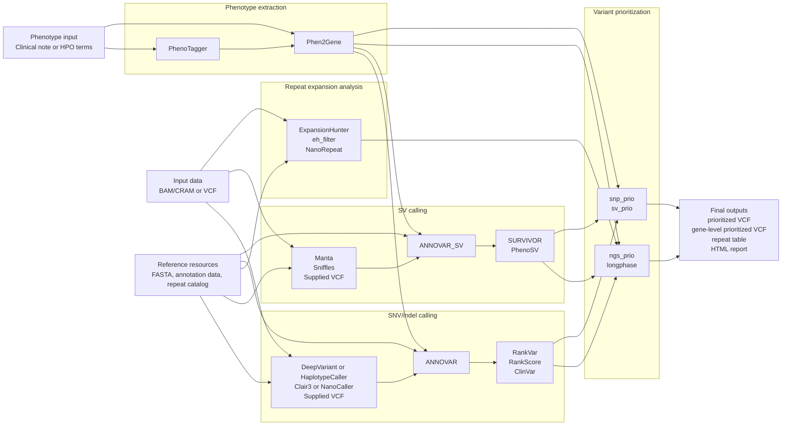
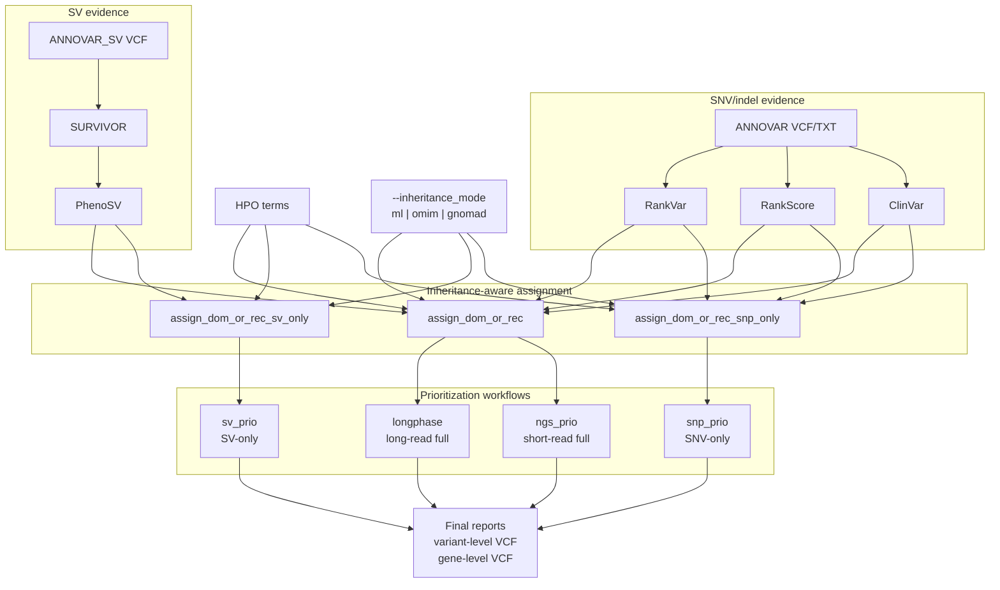

# PipeVar Nuclear Workflow Figures

This page provides focused figure source for the completed nuclear rare-disease
analysis workflow. The diagrams emphasize analysis stages and tool handoffs,
without command-line routing details.

Rendered SVG assets:

- `docs/pipevar_nuclear_workflow.svg`
- `docs/pipevar_prioritization_workflow.svg`

## Figure 1. Nuclear Rare-Disease Workflow

## Figure 2. Variant Prioritization Detail

