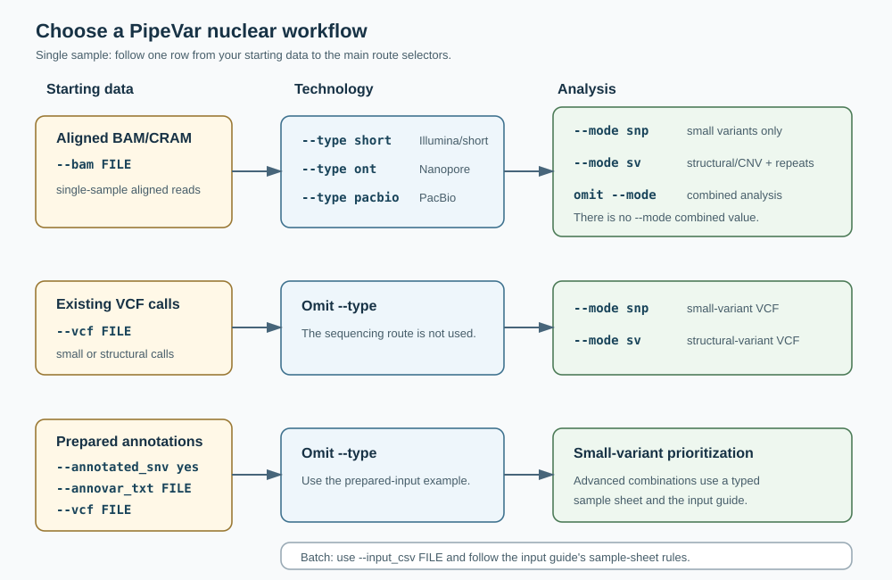
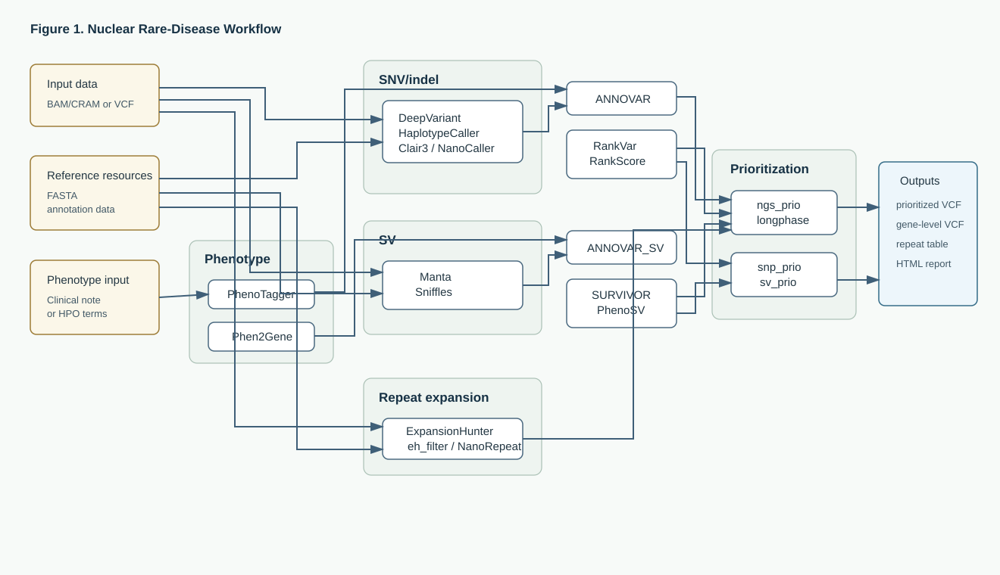
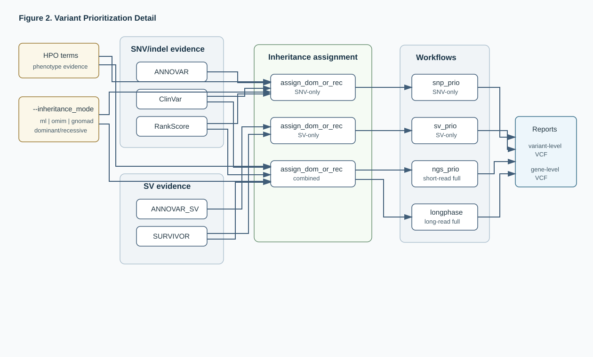

# PipeVar nuclear workflow figures

This visual guide separates route selection, nuclear analysis, and candidate
prioritization into independently readable figures. The embedded SVG files are
the canonical diagrams; there is no duplicate Mermaid source to keep in sync.

## Terms used in the figures

| Term | Plain-language meaning |
| --- | --- |
| HPO | Human Phenotype Ontology codes describing clinical findings |
| VCF | A structured file containing variant calls |
| Small variant | A single-letter DNA change or short insertion/deletion |
| Structural variant | A larger rearrangement such as a deletion, duplication, inversion, or translocation |
| CNV | Copy-number variant: a gain or loss of genomic material |
| Caller | Software that identifies variants from sequencing reads |
| Annotation | Information added to a variant, such as gene overlap or known evidence |
| Phasing | Determining whether variants lie on the same or opposite chromosome copy |
| Compound pair | Two different variants in the same gene considered together in a recessive scenario |

Names such as ANNOVAR, ClinVar, RankVar, PhenoSV, Truvari, and SURVIVOR are
software tools or evidence resources, not types of variants.

## Figure 1. Choose a route

This figure covers one sample at a time. Start with one row and read left to
right. The boxes give the exact main routing choices; omitting `--mode` means
leaving the option out of the command. Batch syntax is documented separately in
the [input guide](INPUTS.md#choose-a-sample-sheet).

Takeaway: aligned-read users must select their sequencing technology. Existing
VCFs require an explicit small- or structural-variant mode, while combined
analysis is an aligned-read route selected by omitting `--mode`.

## Figure 2. Nuclear analysis overview

Read the phenotype path across the top, then follow only the genomic branches
selected by the input and analysis mode. Dashed connections indicate
read-backed or route-conditional contributions.

Takeaway: small variants, structural/copy-number variants, and repeats produce
different evidence. PipeVar brings the selected evidence together with
phenotype-ranked genes during prioritization; not every run produces every
branch or output.

## Figure 3. Evidence prioritization

This figure begins after calling and annotation. It shows the functional rules
used to reduce evidence to reviewable candidate files without exposing internal
module names.

Takeaway: evidence classes retain different meanings. Quality, frequency,
phenotype, inheritance, and phasing rules are applied before variants and genes
are ranked. A dominant scenario considers whether one altered gene copy may
contribute; a recessive scenario generally considers two contributing copies.

These nuclear figures intentionally omit optional mitochondrial analysis. See
the [workflow guide](WORKFLOW.md) for conceptual behavior, [running guide](USAGE.md)
for exact route restrictions, and [output guide](OUTPUTS.md) for conditional
published files.

Return to the [documentation map](../README.md#documentation).
