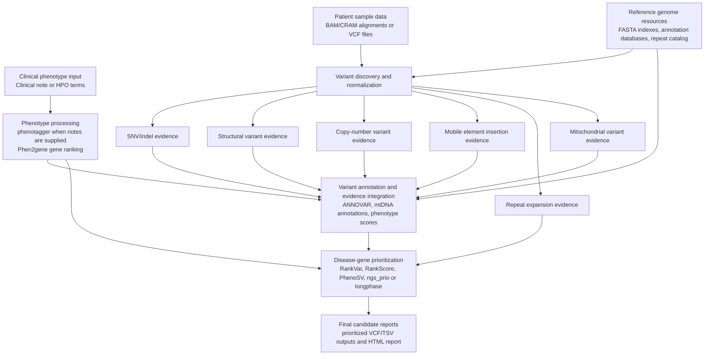
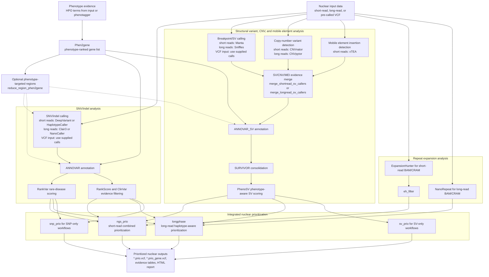
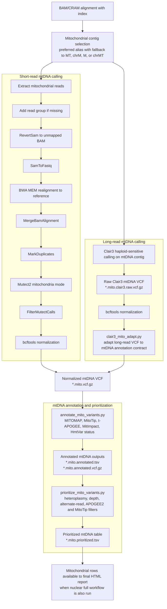
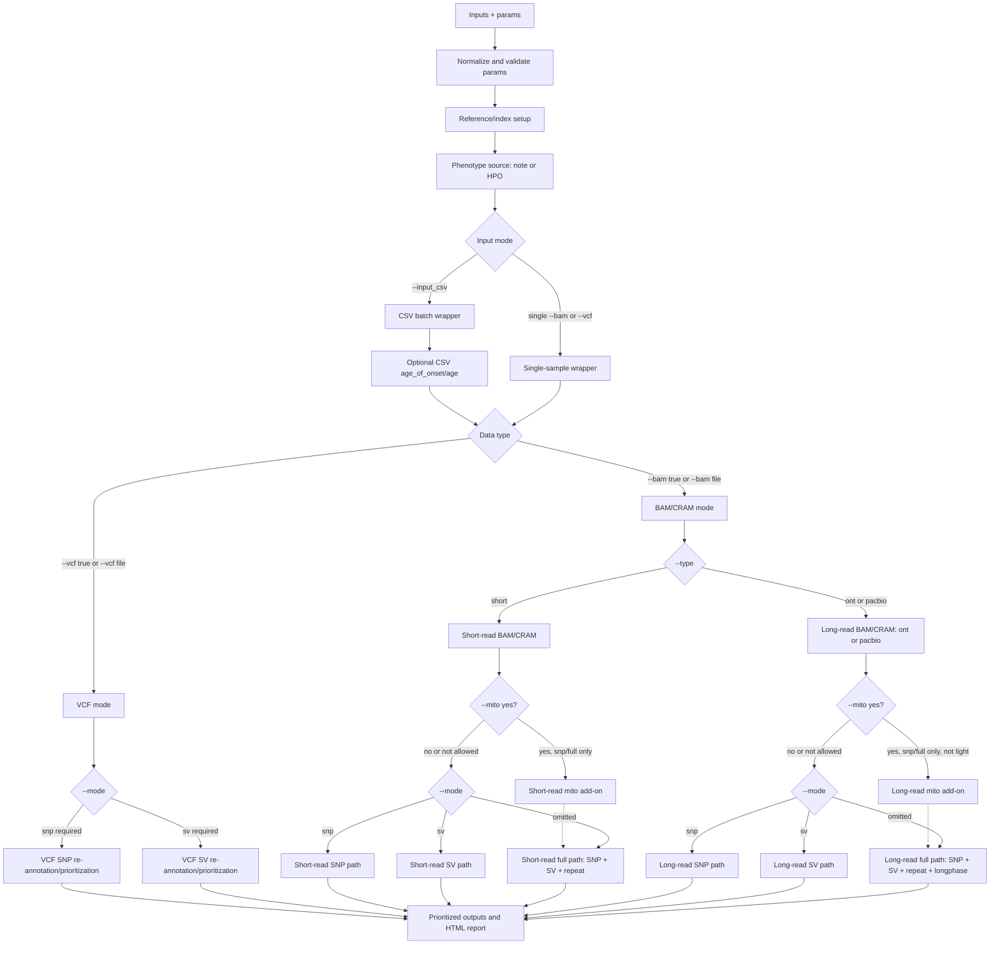
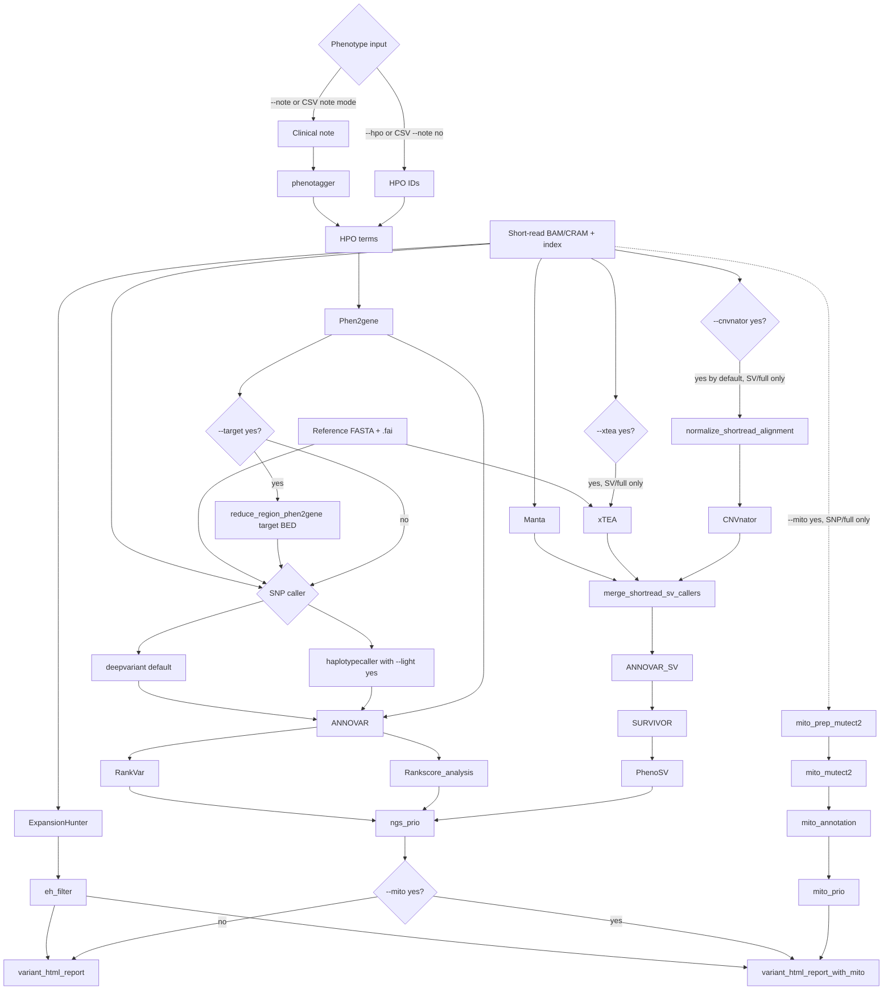
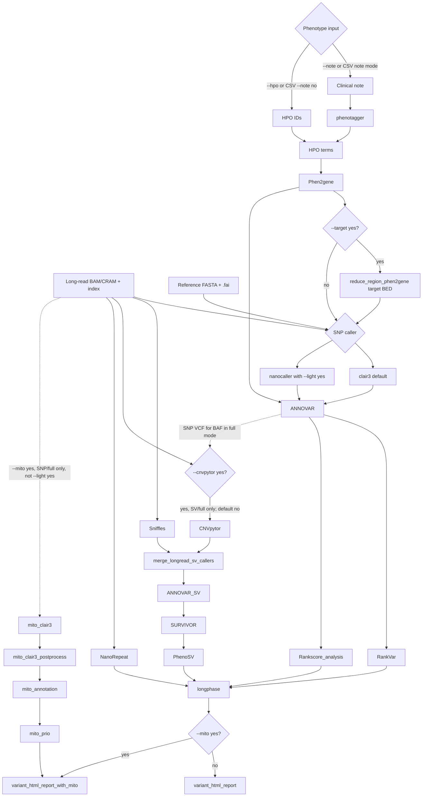
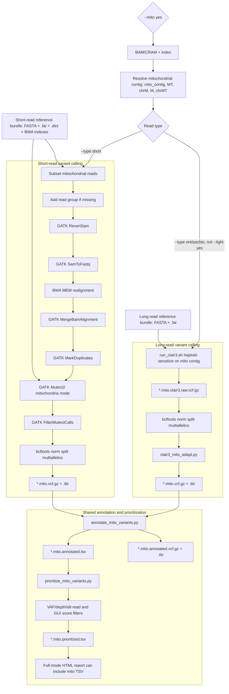

# PipeVar_mito Workflow

This page summarizes PipeVar_mito as a paper-style workflow. The first figures
emphasize analytical stages and evidence flow rather than command-line routing
details. Single-sample and batch execution use the same biological workflow;
batch mode runs the corresponding `multi_*` modules per sample.

## Paper-Style Workflow Summary



## Nuclear Variant Analysis



## Mitochondrial Variant Calling and Annotation



## Reading the Figures

- These first diagrams describe analytical stages, not every run-mode branch
  from `main.nf`.
- Short-read and long-read paths differ mainly at the caller and integration
  steps: short-read full analysis uses `ngs_prio`, while long-read full analysis
  uses `longphase`.
- VCF input bypasses read-level calling and enters the relevant SNP or SV
  annotation/prioritization lane.
- CSV mode follows the same scientific workflow as single-sample mode, using
  batch-aware `multi_*` modules.
- CNV detection and mobile element insertion detection are represented as
  distinct evidence sources in the nuclear workflow. In the current
  implementation, short-read CNVs are called with CNVnator, long-read CNVs with
  CNVpytor, and short-read mobile element insertions with xTEA.
- Optional capabilities such as targeted calling and mitochondrial analysis are
  shown as analysis stages rather than central routing decisions.

## Implementation Routing Appendix

The following diagrams retain implementation-level routing details for readers
who need to map the paper-style workflow back to `main.nf`.

### Top-Level Routing



### Short-Read BAM/CRAM Path



### Long-Read BAM/CRAM Path



### Mitochondrial Calling and Annotation Detail



### Guarded Branch Legend

- `--light yes`: changes the SNP caller only. Short reads use
  `haplotypecaller`; long reads use `nanocaller`. Defaults are `deepvariant`
  for short reads and `clair3` for long reads.
- `--target yes`: inserts `Phen2gene -> reduce_region_phen2gene`, then passes
  the target BED into SNP calling and downstream annotation.
- `--mito yes`: BAM/CRAM only, SNP/full only, never VCF-only or SV-only.
  Short-read mito uses Mutect2; long-read mito uses Clair3 and is rejected with
  long-read `--light yes`.
- `--xtea yes`: short-read BAM/CRAM SV/full only. xTEA VCFs merge with
  Manta and optional CNVnator before `ANNOVAR_SV`.
- `--cnvnator yes`: short-read SV/full branch, default on. The path normalizes
  the alignment before `CNVnator`.
- `--cnvpytor yes`: long-read SV/full branch, default off. In SV-only mode it
  runs read-depth only; in full mode it can use SNP/BAF support from the SNP VCF.

### Verification Notes

The diagrams intentionally omit legacy or undispatched paths such as the old
`*_light` subworkflows and `cuteSV`. Current `main.nf` dispatches unified
workflows and passes caller mode with `short_snp_caller` and `long_snp_caller`.

To check the diagrams against the current source:

```bash
rg -n "SINGLE_ALIGNMENT_|INPUT_CSV_|short_snp_caller|long_snp_caller|clean_mito|clean_xtea|clean_cnvpytor" main.nf
rg -n "workflow SINGLE_ALIGNMENT_ALL_NGS|workflow SINGLE_ALIGNMENT_ALL_LONGPHASE|workflow SINGLE_ALIGNMENT_NGS_MITO|workflow SINGLE_ALIGNMENT_LONG_MITO|include \\{" subworkflows/*/main.nf
rg -n "CNVnator|CNVpytor|xTEA|xtea|merge_shortread_sv_callers|merge_longread_sv_callers" subworkflows modules
```
