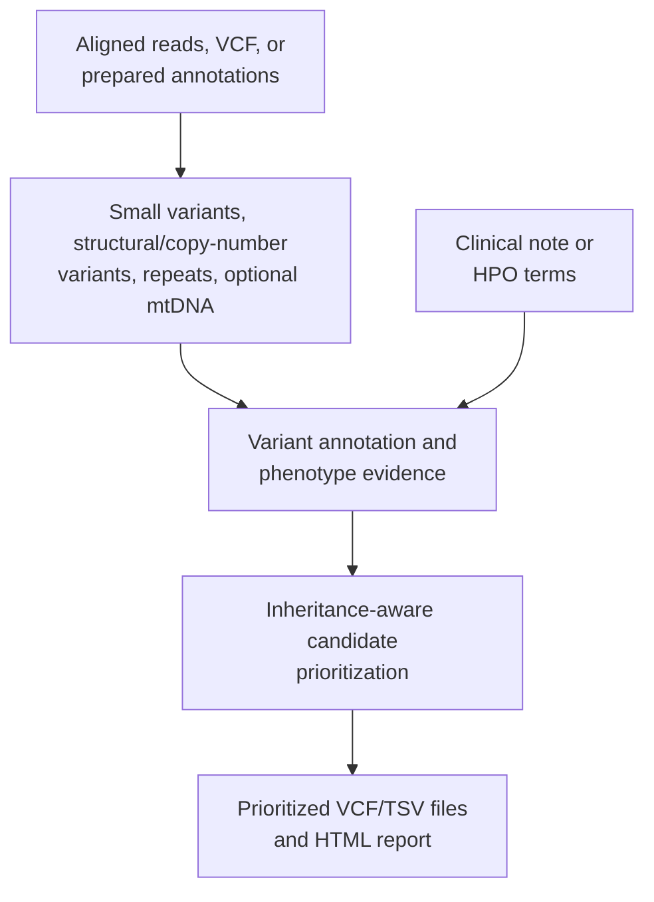
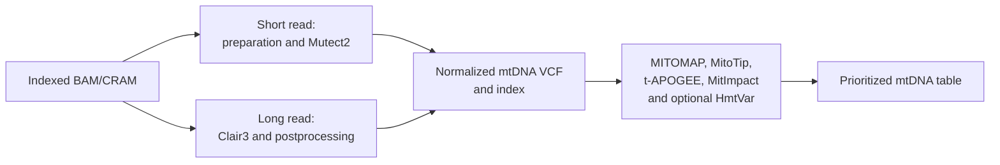

# PipeVar workflow

This page explains PipeVar's analysis stages and evidence flow. For commands and
route selection, see [Running PipeVar](USAGE.md). For exact published files, see
the [output guide](OUTPUTS.md).

## On this page

- [Workflow summary](#workflow-summary)
- [Phenotype preparation](#1-phenotype-preparation)
- [Small-variant analysis](#2-small-variant-analysis)
- [Structural and copy-number analysis](#3-structural-and-copy-number-analysis)
- [Repeat analysis](#4-repeat-analysis)
- [Mitochondrial analysis](#5-mitochondrial-analysis)
- [Evidence integration](#6-evidence-integration)
- [Advanced prioritization behavior](#advanced-prioritization-behavior)
- [Figures](#figures)

## Workflow summary

PipeVar combines genomic evidence with patient phenotype information. Aligned
reads can enter variant discovery, while supplied VCF or ANNOVAR files enter at
later stages. Read-backed repeat and mitochondrial analysis require BAM/CRAM.

## 1. Phenotype preparation

Users provide Human Phenotype Ontology terms directly or provide a clinical
note. Clinical notes use PhenoTagger by default and can use externally mounted,
GPU-backed PhenoGPT2. Phen2Gene converts the HPO terms into a phenotype-ranked
gene list.

With targeted analysis enabled, the top Phen2Gene results are converted into
genomic intervals for supported small-variant calling and annotation. A final
gene restriction can also be applied during prioritization.

## 2. Small-variant analysis

| Data | Default caller | Light caller |
| --- | --- | --- |
| Short read | DeepVariant | GATK HaplotypeCaller |
| Oxford Nanopore | Clair3 | NanoCaller |
| PacBio | Clair3 | NanoCaller |
| VCF or prepared annotations | Supplied variants | Not applicable |

Called or supplied variants are annotated with the hg38 ANNOVAR database set.
RankVar evaluates rare-disease and inheritance evidence. RankScore contributes
prediction scores, while accepted ClinVar assertions remain available for final
candidate assignment.

## 3. Structural and copy-number analysis

Short-read analysis uses Manta for structural variants and CNVnator for
copy-number evidence. Their records are normalized and consolidated with
Truvari before ANNOVAR structural annotation.

Long-read analysis uses Sniffles. Combined long-read workflows keep the complete
Sniffles VCF, including supporting read names, as LongPhase phasing context.
Annotation and phenotype filtering remain a separate evidence path.

After annotation, optional common-variant filtering removes records above the
upstream ceiling. SURVIVOR converts supported event types into the inputs used by
PhenoSV. PhenoSV supplies phenotype-aware event and gene evidence for final
prioritization.

## 4. Repeat analysis

Short-read BAM/CRAM routes use ExpansionHunter and publish a filtered repeat
table. Long-read BAM/CRAM routes use NanoRepeat. VCF-only and annotation-only
routes cannot perform this read-backed analysis.

## 5. Mitochondrial analysis

Mitochondrial analysis is opt-in and produces results separately from nuclear
prioritized VCFs.

The short-read branch identifies the mitochondrial contig, extracts and
realigns reads, marks duplicates, and runs Mutect2 in mitochondrial mode. It
requires the reference FASTA index, sequence dictionary, and BWA sidecars.

The long-read branch identifies the mitochondrial contig, runs a mitochondrial
Clair3 call, and adapts the VCF to the annotation contract. It requires the
reference FASTA index.

Both branches normalize and index the callset, annotate the variants, and
produce a prioritized TSV. Known mitochondrial contig aliases are examined when
the preferred alias is absent.

## 6. Evidence integration

Small-variant-only and structural-variant-only runs use their corresponding
prioritization paths. Combined short-read analysis integrates small-variant,
structural/copy-number, phenotype, and repeat evidence. Combined long-read
analysis uses LongPhase to add read-backed phasing context before prioritization.

Final ranking uses evidence classes rather than comparing every score as if it
had the same meaning. ClinVar evidence has the highest class, followed by
combined RankVar and RankScore evidence, RankVar evidence, and then the shared
score class containing RankScore and PhenoSV evidence. Deterministic category
and coordinate rules resolve ties.

## Advanced prioritization behavior

The following sections describe defaults used during prioritization. New
operators generally do not need to tune them for a first run. In broad terms, a
dominant model considers whether one altered gene copy may contribute to
disease, while a recessive model generally looks for two contributing copies.
A compound-heterozygous pair consists of two different variants in the same
gene, ideally confirmed on opposite parental copies.

### Population-frequency behavior

Small variants use separate effective frequency ceilings for dominant and
recessive scenarios. The defaults are `0.001` and `0.01`, respectively. Exact
threshold values pass. Missing frequency values retain the pipeline's
historical zero-frequency behavior, while malformed non-missing values fail.

The selected gnomAD value is the maximum available group-max FAF95 across the
configured exome and genome annotations, falling back to group-max observed
frequency when FAF95 is unavailable. PipeVar records the chosen value and source
in the final evidence.

Accepted ClinVar pathogenic or likely-pathogenic candidates remain available
for auditable assignment, but do not automatically rescue a frequency-
incompatible primary scenario.

### Common structural-variant behavior

Common structural-variant filtering uses an effective dominant ceiling of
`0.005` and recessive ceiling of `0.01`. Matches above the permissive upstream
ceiling are removed before PhenoSV. Retained matches carry their cohort
identifier, frequency, match method, overlap, and insertion evidence into final
assignment.

Breakpoint and interval matching can be tuned through the parameters documented
in [Parameter reference](PARAMETERS.md#common-structural-variant-filtering).
Mitochondrial events are exempt, and breakend/translocation records are not
evaluated by this matcher.

### PhenoSV event behavior

PipeVar scores simple deletions, duplications, inversions, and insertions
separately from breakend/translocation adjacencies. Reciprocal breakend mates
share one logical phenotype event while retaining both original VCF records.

The whole-event PhenoSV score determines thresholding and reporting. PipeVar
selects one gene from the highest-scoring PhenoSV gene row for that event.
ANNOVAR gene overlaps remain audit metadata rather than expanding one event into
multiple reported candidates.

PipeVar validates structural type against both `INFO/SVTYPE` and ALT. Clear
symbolic or breakend representations can fill a missing type. Conflicts,
ambiguous multi-allelic records, and unclassifiable alleles are warned and
skipped rather than guessed.

### Compound-heterozygous phasing

Pairs with the same valid phase-set value and opposite phased orientations are
accepted as confirmed trans. Same-phase-set pairs with the same orientation are
rejected as cis.

When phase-set information is missing or malformed, PipeVar falls back to
pipe-phased genotype orientation. Different valid phase sets, slash-unphased
genotypes, and mixed phased/unphased pairs require
`--allow_unphased_comphet yes`. Orientation without a shared phase block is a
heuristic and is not equivalent to confirmed shared-phase-set evidence.

### Mitochondrial thresholds

Mitochondrial prioritization defaults to minimum variant allele fraction `0.01`,
depth `50`, and alternate reads `5`. The HTML report uses separate defaults of
allele fraction `0.5`, APOGEE2 `0.5`, and MitoTip `12.66`.

## Figures

For standalone nuclear figures, see
[`PIPEVAR_NUCLEAR_FIGURES.md`](PIPEVAR_NUCLEAR_FIGURES.md),
[`pipevar_route_selection.svg`](pipevar_route_selection.svg),
[`pipevar_nuclear_workflow.svg`](pipevar_nuclear_workflow.svg), and
[`pipevar_prioritization_workflow.svg`](pipevar_prioritization_workflow.svg).

Return to the [documentation map](../README.md#documentation).
