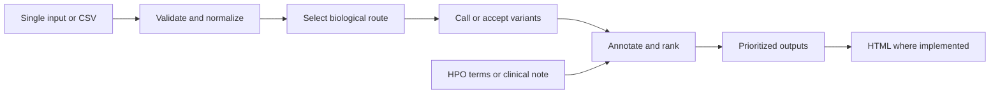

# How PipeVar workflows are constructed

This is a short map from input to code and results. See
[biological workflow details](docs/WORKFLOW.md), [usage](docs/USAGE.md), and
[outputs](docs/OUTPUTS.md) for interpretation and commands.

## Entry and sample identity

`main.nf` selects the biological route. The named `INPUT_PREPARATION` helper
validates parameters and manifests, prepares references, and normalizes
single-file or CSV inputs into sample-keyed records. The active graph contains
15 named workflows and 45 process definitions.

A channel is a stream of records passed between workflow stages.
An alignment record normally has `(sample_id, alignment, index,
phenotype_file)`. Downstream channels join on `sample_id`, rather than arrival
order: annotations still match the right sample when tools finish in different
orders. Required joins reject missing or duplicate keys.

Single and CSV runs use the same route workflows. The prioritizers accept an
optional age-of-onset value: single-sample inputs pass a blank value, while CSV
rows can provide normalized age metadata. `batch_input` is retained only for
the batch-only LongPhase haplotag publication contract.

## Active biological routes

| Analysis | Route directory | Main operations |
| --- | --- | --- |
| Short-read SNP | `ngs` (`snp`) | DeepVariant or GATK, then ANNOVAR, RankVar/RankScore, and SNP prioritization |
| Long-read SNP | `long` (`snp`) | Clair3 or NanoCaller, then ANNOVAR, RankVar/RankScore, and SNP prioritization |
| Short-read SV | `ngs` (`sv`) | Manta, optional CNVnator/xTea, merging, SV annotation, and prioritization |
| Long-read SV | `long` (`sv`) | Sniffles, SV annotation, NanoRepeat, and prioritization |
| Short-read combined | `ngs` (`combined`) | SNP and SV branches, joint prioritization, and report |
| Long-read combined | `long` (`combined`) | SNP and SV branches, LongPhase, joint prioritization, and report |
| Supplied VCF | `vcf` (`snp` or `sv`) | Enter at the mode-specific annotation branch without calling |
| Prepared annotations | `preannotated_*` | Reuse SNV annotations and integrate supplied or called SV evidence as requested |

`preannotated_sv` combines prepared SNV and supplied SV evidence despite its
abbreviated directory name. SV processing can include ANNOVAR, common-SV
filtering, SURVIVOR conversion, and PhenoSV. The shared GATK helper runs
HaplotypeCaller, VariantRecalibrator, and ApplyVQSR using one resource bundle
per run.

## Phenotype and optional branches

Clinical notes become HPO terms through PhenoTagger or PhenoGPT2. Phen2Gene
provides phenotype-ranked genes. Targeted analysis derives intervals from those
genes.

`--light yes` selects GATK for short reads or NanoCaller for long reads inside
the active routes. There is one implementation per route for both caller modes.

Short-read alignment routes run ExpansionHunter. Long-read SV and combined
routes run NanoRepeat; long-read small-variant-only does not. Combined routes produce the
main HTML report. Small-variant-only routes do not call an HTML report module, while some
SV and prepared-annotation routes have their own report path.

Optional mitochondrial workflows run alongside nuclear analysis. Short reads
use preparation and Mutect2; long reads use mitochondrial Clair3. Both annotate
and prioritize mitochondrial variants, and supported combined reports include
the mitochondrial table.

Pinned upstream operations live in `modules/nf-core`. PipeVar-owned biological
logic and adapters live in the other module directories. `nextflow.config`
controls resources, containers, publishing, and execution profiles.

Shared helpers handle input preparation (`input_preparation`), GATK resource
and calling preparation (`gatk_snp_calling`), pre-annotated SNV and imported-SV
evidence (`preannotated_shared`), and phase, haplotag, and prioritization wiring
(`longphase_processing`).
